# Problem Solver

커뮤니티 글 CSV를 기반으로 유저 페인포인트를 누락 없이 분석하고, 개발 전 PRD 작성 여부를 판단하기 위한 pre-PRD 문제정의 파이프라인입니다.

이 레포는 단순한 프롬프트 모음이 아니라, 대량 CSV를 검증 가능한 중간 산출물로 나누고 최종 문제정의와 제품 방향성까지 이어주는 분석 시스템입니다.

## 한눈에 보기

```mermaid
flowchart LR
  A["community-analyzer CSV"] --> B["source_manifest.json"]
  B --> C["chunks/*.csv"]
  C --> D["labels/*.csv"]
  D --> E["labeled_posts.csv"]
  E --> F["label_summary.json"]
  F --> G["problem-definition.md"]
  G --> H["opportunity-brief.md"]
  H --> I["product-direction.md"]
  I --> J["validation-plan.md"]
  J --> K["prd-readiness.md"]
```



최종 목표는 바로 기능을 정하는 것이 아닙니다. CSV에서 발견한 반복 페인포인트를 근거로 문제를 정의하고, 기회와 방향성을 잡고, 검증 계획을 세운 뒤 PRD를 써도 되는지 판단합니다.

## 언제 쓰나

- 커뮤니티 글, 검색 결과, 댓글 CSV에서 반복되는 유저 불편을 찾고 싶을 때
- 대량의 글을 청크로 나눠도 최종 분석에서 누락이나 중복을 막고 싶을 때
- 개발 전에 PO 관점의 문제정의, 기회평가, 제품방향성, 검증계획을 만들고 싶을 때
- 커뮤니티 근거만으로 바로 PRD를 쓰는 위험을 줄이고 싶을 때

## 산출물

| 파일 | 역할 |
| --- | --- |
| `source_manifest.json` | 원본 모든 행의 포함/제외 여부와 `record_id`를 추적합니다. |
| `audit-report.md` | 원본 행 수, 분석 포함 행 수, 제외 행 수, 청크 수를 요약합니다. |
| `chunks/*.csv` | Codex가 나눠서 라벨링할 작업 단위입니다. |
| `labels/*.csv` | 각 글의 페인포인트, JTBD, 심각도, 근거 인용 등을 기록합니다. |
| `labeled_posts.csv` | 라벨을 원본 메타데이터와 합친 row-level 근거 파일입니다. |
| `label_summary.json` | 반복 페인포인트, 세그먼트, 검토 필요 행을 집계합니다. |
| `problem-definition.md` | 근거 기반 최종 문제정의 문서입니다. |
| `opportunity-brief.md` | 어떤 문제를 우선 기회로 볼지 정리합니다. |
| `product-direction.md` | 제품 방향성, 솔루션 원칙, 하지 않을 일을 정리합니다. |
| `validation-plan.md` | PRD 전에 검증할 위험 가정과 실험 계획을 정리합니다. |
| `prd-readiness.md` | PRD 작성 가능/보류를 판단합니다. |

## 빠른 시작

### 1. 스킬 설치

Codex에서 이 분석 스킬을 바로 쓰려면 먼저 설치합니다.

```bash
python3 scripts/install_skill.py
```

설치 후 Codex에게 이렇게 요청할 수 있습니다.

```text
community-painpoint-analysis 스킬로 이 CSV를 분석해서 pre-PRD 산출물까지 만들어줘.
입력 CSV: path/to/community.csv
주제: 정수기 렌탈
출력 폴더: analysis-runs/2026-06-21-rental
```

### 2. 로컬에서 파이프라인 실행

레포 안 스크립트를 직접 실행할 수도 있습니다.

```bash
SKILL_DIR="$PWD/skills/community-painpoint-analysis"
RUN_DIR="analysis-runs/$(date +%F)-topic"
```

원본 CSV를 준비합니다.

```bash
python3 "$SKILL_DIR/scripts/prepare_dataset.py" \
  --topic "topic" \
  --output-dir "$RUN_DIR" \
  --chunk-size 100 \
  path/to/source.csv
```

생성된 파일을 확인합니다.

```bash
ls "$RUN_DIR"
ls "$RUN_DIR/chunks"
```

## 핵심 사용 흐름

### 1. 데이터 준비

`prepare_dataset.py`는 원본 CSV의 모든 행을 `source_manifest.json`에 기록합니다. 분석 가능한 행은 `chunks/*.csv`로 나누고, 제외된 행은 `exclusion_reason`을 남깁니다.

```bash
python3 "$SKILL_DIR/scripts/prepare_dataset.py" \
  --topic "rental" \
  --output-dir "$RUN_DIR" \
  --chunk-size 100 \
  path/to/source.csv
```

여기서 중요한 원칙은 간단합니다.

- 원본 행은 사라지지 않아야 합니다.
- 분석에서 제외된 행은 이유가 있어야 합니다.
- 청크는 작업 단위일 뿐, 최종 결론 단위가 아닙니다.

### 2. 코드북 만들기

대표 샘플 30-50개를 보고 `codebook.md`를 만듭니다. 코드북에는 페인포인트 분류, 포함/제외 기준, 애매한 케이스 처리 기준을 적습니다.

참고 문서:

```bash
open "$SKILL_DIR/references/labeling-codebook-guide.md"
```

권장 위치:

```text
$RUN_DIR/codebook.md
```

### 3. 청크 라벨링

`$RUN_DIR/chunks/*.csv`를 하나씩 읽고, 같은 수의 라벨 CSV를 `$RUN_DIR/labels/`에 저장합니다.

라벨 CSV는 반드시 아래 컬럼을 사용해야 합니다.

```text
record_id,is_relevant,irrelevant_reason,user_context,journey_stage,jtbd,primary_pain_point,secondary_pain_point,sentiment,severity,segment_candidate,evidence_quote,confidence,needs_review
```

라벨링 규칙:

- `record_id`는 원본 청크의 값을 그대로 사용합니다.
- 관련 글이면 `is_relevant=true`로 두고 JTBD, 페인포인트, 근거 인용을 채웁니다.
- 무관 글이면 `is_relevant=false`로 두고 `irrelevant_reason`을 채웁니다.
- 애매하면 버리지 말고 `needs_review=true`로 표시합니다.
- JTBD는 한국어로 씁니다. 예: `...할 때, ...하고 싶다. 그래야 ...할 수 있다.`

### 4. 누락/중복 검증

최종 분석 전에 반드시 검증합니다. 이 단계가 이 레포의 핵심 안전장치입니다.

```bash
python3 "$SKILL_DIR/scripts/validate_labels.py" \
  "$RUN_DIR/source_manifest.json" \
  "$RUN_DIR"/labels/*.csv
```

검증이 실패하면 아직 분석하면 안 됩니다. 누락된 `record_id`, 중복된 `record_id`, 잘못된 값, 비어 있는 필드를 먼저 고칩니다.

### 5. 병합과 요약

검증이 통과하면 라벨을 원본 메타데이터와 병합합니다.

```bash
python3 "$SKILL_DIR/scripts/merge_labels.py" \
  "$RUN_DIR/source_manifest.json" \
  "$RUN_DIR/labeled_posts.csv" \
  "$RUN_DIR"/labels/*.csv
```

그 다음 반복 페인포인트를 집계합니다.

```bash
python3 "$SKILL_DIR/scripts/summarize_labels.py" \
  "$RUN_DIR/labeled_posts.csv" \
  "$RUN_DIR/label_summary.json"
```

### 6. 문제정의 생성

```bash
python3 "$SKILL_DIR/scripts/render_problem_definition.py" \
  "$RUN_DIR/source_manifest.json" \
  "$RUN_DIR/labeled_posts.csv" \
  "$RUN_DIR/label_summary.json" \
  "$RUN_DIR/problem-definition.md" \
  --codebook "$RUN_DIR/codebook.md" \
  --audit "$RUN_DIR/audit-report.md"
```

`problem-definition.md`를 읽고 표현은 다듬어도 됩니다. 다만 아래는 지우면 안 됩니다.

- 분석 커버리지 숫자
- 대표 `record_id`
- 반대 근거와 리스크
- 검토 필요 항목

### 7. pre-PRD 산출물 생성

문제정의 이후에는 PRD로 바로 가지 않고, 아래 순서로 기회와 검증 계획을 만듭니다.

```bash
python3 "$SKILL_DIR/scripts/render_opportunity_brief.py" \
  "$RUN_DIR/source_manifest.json" \
  "$RUN_DIR/labeled_posts.csv" \
  "$RUN_DIR/label_summary.json" \
  "$RUN_DIR/problem-definition.md" \
  "$RUN_DIR/opportunity-brief.md"
```

```bash
python3 "$SKILL_DIR/scripts/render_product_direction.py" \
  "$RUN_DIR/label_summary.json" \
  "$RUN_DIR/opportunity-brief.md" \
  "$RUN_DIR/product-direction.md"
```

```bash
python3 "$SKILL_DIR/scripts/render_validation_plan.py" \
  "$RUN_DIR/label_summary.json" \
  "$RUN_DIR/product-direction.md" \
  "$RUN_DIR/validation-plan.md"
```

```bash
python3 "$SKILL_DIR/scripts/render_prd_readiness.py" \
  "$RUN_DIR/source_manifest.json" \
  "$RUN_DIR/label_summary.json" \
  "$RUN_DIR/problem-definition.md" \
  "$RUN_DIR/opportunity-brief.md" \
  "$RUN_DIR/product-direction.md" \
  "$RUN_DIR/validation-plan.md" \
  "$RUN_DIR/prd-readiness.md"
```

## PRD 작성 판단 기준

`prd-readiness.md`가 `PRD 작성 보류`라고 말하면 아직 PRD를 쓰지 않습니다. 이 상태에서는 `validation-plan.md`를 실행해서 인터뷰, 랜딩페이지, 컨시어지 테스트 같은 행동 검증을 먼저 해야 합니다.

이 파이프라인의 기본 태도는 보수적입니다.

- 커뮤니티 반복 신호가 약하면 PRD 보류
- 커뮤니티 반복 신호는 강하지만 행동 검증이 없으면 PRD 보류
- 문제 강도와 행동 검증이 모두 충분할 때만 PRD 작성 가능

## 입력 CSV 형식

`community-analyzer`가 만든 CSV를 기준으로 합니다. 필수 컬럼은 아래와 같습니다.

```text
site,post_id,board_code,board_name,category_name,title,author,posted_at,url,view_count,like_count,dislike_count,comment_count,matched_queries,matched_search_urls,search_pages,search_excerpt,body_text,comments_text,comments_json,crawl_status,crawl_error
```

`title`, `search_excerpt`, `body_text`, `comments_text` 중 하나 이상에 의미 있는 텍스트가 있어야 분석에 포함됩니다. 크롤링 실패 행이라도 본문이나 댓글 텍스트가 있으면 분석 대상으로 남길 수 있습니다.

## 품질 체크리스트

분석을 완료했다고 말하기 전에 아래를 확인합니다.

- `validate_labels.py`가 통과했는가?
- `labeled_posts.csv`에 포함 대상 `record_id`가 정확히 한 번씩 있는가?
- `problem-definition.md`의 주요 주장마다 근거 `record_id`가 있는가?
- `opportunity-brief.md`가 시장 규모나 매출을 근거 없이 단정하지 않는가?
- `product-direction.md`가 PRD나 기능 명세로 과하게 점프하지 않는가?
- `validation-plan.md`가 실제 행동 검증 방법을 포함하는가?
- `prd-readiness.md`를 읽고 PRD 작성/보류 판단을 확인했는가?

## 개발자용 명령어

전체 테스트:

```bash
python3 -m unittest discover -s tests -v
```

스킬 설치:

```bash
python3 scripts/install_skill.py
```

설치 경로 확인만 하기:

```bash
python3 scripts/install_skill.py --dry-run
```

## 이 레포가 필요한 이유

커뮤니티 분석은 프롬프트 하나로 끝내기 어렵습니다. 대량 글을 청크로 나누면 누락, 중복, 라벨 흔들림, 근거 없는 종합이 쉽게 생깁니다.

이 레포는 그 위험을 줄이기 위해 다음을 코드로 강제합니다.

- 모든 원본 행에 안정적인 `record_id` 부여
- 포함/제외 행 추적
- 청크별 라벨링 후 전체 검증
- row-level 근거 기반 병합
- 문제정의에서 PRD 진입 판단까지 산출물 분리

즉, 목적은 "그럴듯한 요약"이 아니라 "나중에 다시 검토할 수 있는 문제정의 시스템"입니다.
